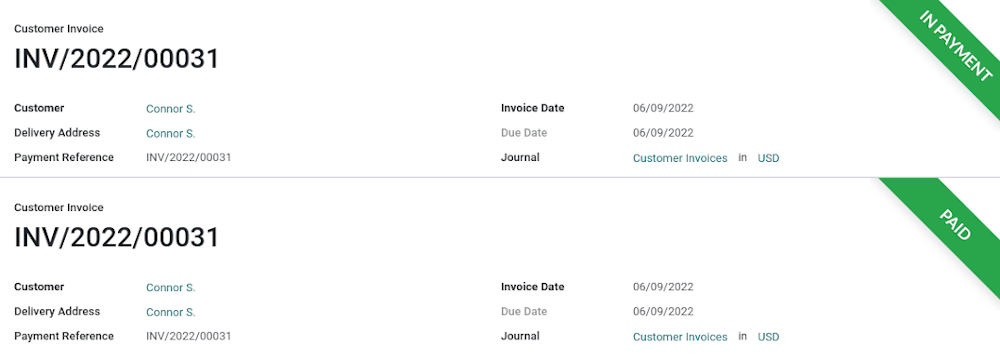
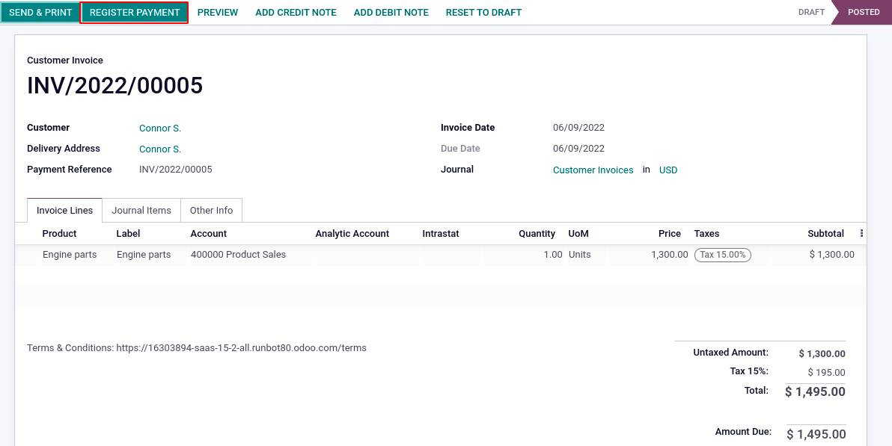
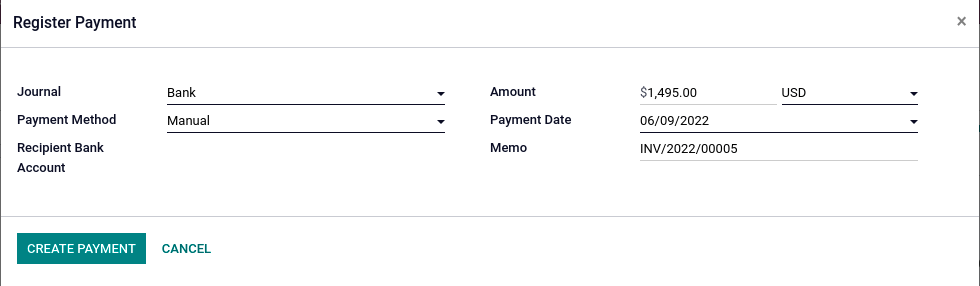
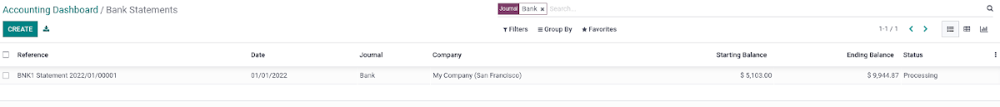
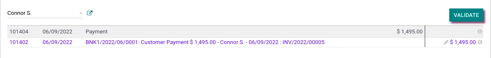
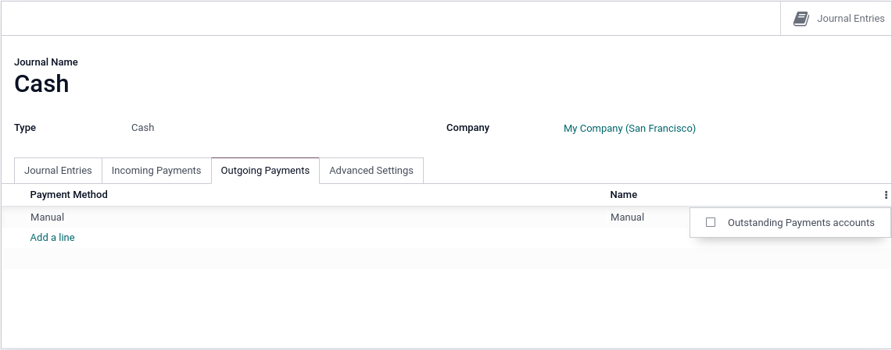

===================
Bank reconciliation
===================

Introduction
============

Bank reconciliation describes the process of linking -or matching- a registered payment of a bill or
an invoice with its corresponding bank statement. Since version 14, Odoo no longer marks invoices or
bills as "Paid" when a payment is registered but rather indicates it as "In Payment". The reason for
this being that Odoo requires the registered payment to be matched with a bank statement to serve as
proof it has been paid. The "Paid" status will only appear once a payment has been reconciled.

Entries can be reconciled either manually or automatically, depending on your needs. If you wish to
automate your reconciliation process, you can refer to `our reconciliation models documentation <htt
ps://www.odoo.com/documentation/15.0/applications/finance/accounting/bank/reconciliation/reconciliat
ion_models.html>`_.

.. seealso::
   - :doc:`../feeds/bank_synchronization`
   - Our `related video <https://www.odoo.com/slides/slide/customer-and-vendor-payments-1690?fullscr
     een=1>`_ on *Customer and Vendor Payments*.

.. note::
   - if you wish to bypass the **"In Payment"** status, click :ref:`here <bypass>`

Bank reconciliation
===================

Payment registration
--------------------

If you have received a payment confirmation from your customer, or if you have made a payment to one
of your vendors, click on :guilabel:`Register Payment` from within the related invoice or bill. Once
you click, a pop-up window will appear prompting you to input the payment method and other related
payment information. When done, click :guilabel:`Create Payment`. The payment status of the document
will change to "In Payment".

Bank statement matching
-----------------------

When the payment is registered, you must now match it with its corresponding bank statement. Head to
the **Accounting Dashboard**, click on the **Bank** journal, and create a new bank statement. If you
have synchronized your Odoo instance with your bank account, select the imported bank statement that
matches your invoice or bill.

Once you have populated the required fields, click on **Post** and then **Reconcile**. You will land
on the reconciliation page, where you can match the payment with the corresponding bank statement.
Odoo automatically suggests matches based on the **Label**, **Partner**, and **Amount** entered upon
the creation or import of the bank statement. However, if no matches are suggested or if the match
does not correspond with its counterpart entry, you can always change the partner, or select another
payment from the list by clicking on the blue line (cf. screenshot below).

Finally, click on :guilabel:`Validate` to reconcile both entries. The payment status ribbon will now
switch to "Paid".

.. _bypass:

"In payment" status bypass
--------------------------

It is possible to bypass the "In Payment" status of an invoice or bill if needed. Go to
:menuselection:`Accounting --> Configuration --> Journals`, click on the **Cash** journal, and enter
the :guilabel:`Outgoing Payments` tab. Then, click on the optional column button, check
*Outstanding Payments accounts*, and enter the *Cash* Account in the now-visible
**Outstanding Payments accounts** column. When registering a payment, selecting the *Cash* journal
when the pop-up window appears will now effectively bypass the "In Payment" status and indicate the
"Paid" status ribbon on the document.

